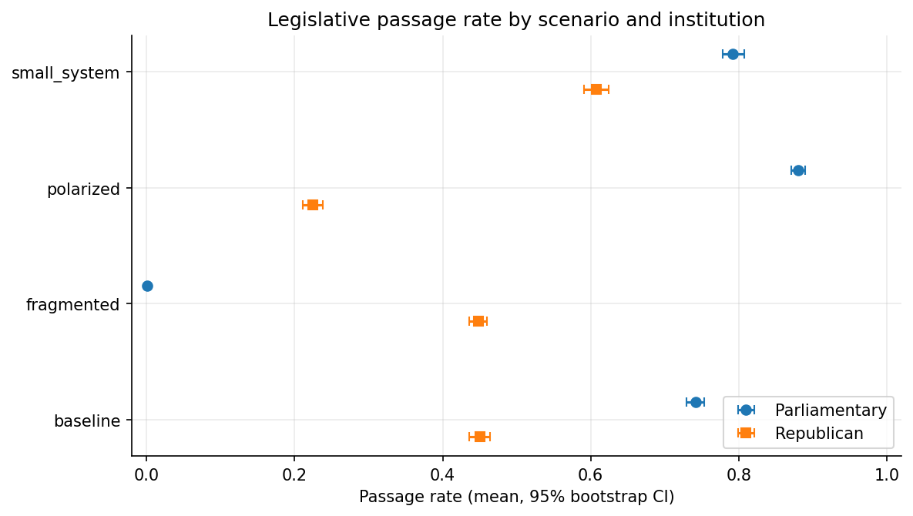
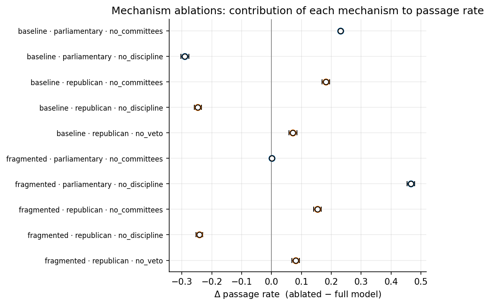
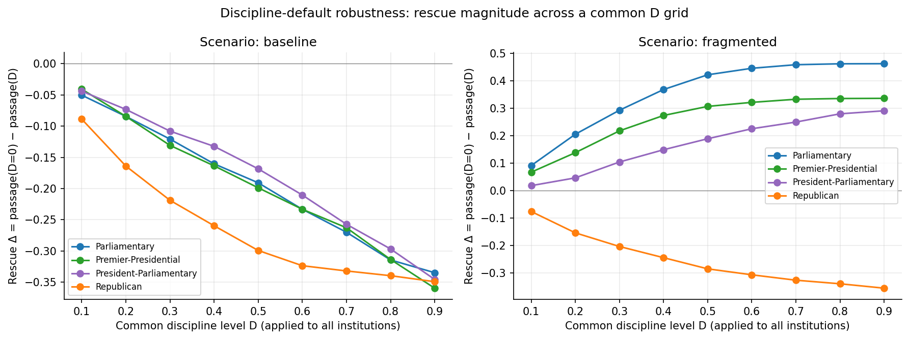
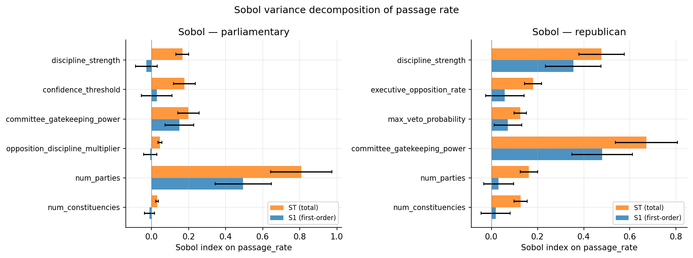
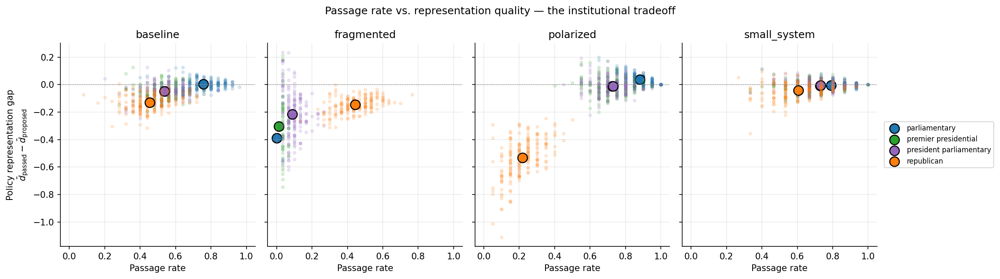

# Institutional Representation ABM

*How democratic institutions mediate the translation of citizen preferences into legislative outcomes.*

[](https://github.com/tofuadmiral/institutional-representation-abm/actions/workflows/ci.yml)
[](https://www.python.org/downloads/)
[](LICENSE)
[](tests/)
[](https://institutional-representation-abm.streamlit.app/)

<p align="center">
  
</p>

<p align="center">
  <b>🔗 <a href="https://institutional-representation-abm.streamlit.app/">Live interactive demo on Streamlit</a></b>
  &nbsp;·&nbsp;
  <a href="paper/main.tex">Paper draft</a>
  &nbsp;·&nbsp;
  <a href="docs/PAPER_OUTLINE.md">Findings summary</a>
</p>

This repository implements a Mesa-based agent-based model that compares four democratic legislative institutions (pure parliamentary, pure republican, premier-presidential, president-parliamentary) across four scenarios (baseline, fragmented, polarised, small-system) with a full statistical harness (N=200 seeds, bootstrap CIs, Morris and Sobol sensitivity, mechanism ablations).

## Quick start

```bash
python3 -m venv .venv && source .venv/bin/activate
pip install -r requirements.txt
pytest tests/ -v

# full four-institution comparison at N=200 seeds (~5 minutes on 8 cores)
python -m experiments.multiseed_comparison --scenarios all --seeds 200 --output results/main/

# Morris + Sobol sensitivity analysis
python -m experiments.sensitivity --output results/main/

# mechanism ablations (committees / discipline / veto)
python -m experiments.ablation --scenarios baseline fragmented polarized --seeds 200 --output results/main/

# interactive UI with sliders over every config parameter
# (or use the hosted version: https://institutional-representation-abm.streamlit.app/)
streamlit run streamlit_app/app.py
```

## Headline findings

### 1. Discipline as the aggregation mechanism

Under fragmentation, parliamentary passage collapses to 0.05%. The `no_discipline` ablation restores passage to 46.7%. Rescue magnitude falls monotonically across the four institutions in the order of their dependence on parliamentary-majority government formation:

| Institution | Passage @ fragmented | `no_discipline` Δ |
|---|---:|---:|
| Parliamentary | 0.001 | **+0.466** |
| Premier-presidential | 0.013 | +0.312 |
| President-parliamentary | 0.086 | +0.233 |
| Republican | 0.448 | −0.242 |

Under polarisation the same ordering holds in magnitude but with the opposite sign (`no_discipline` costs parliamentary 66 percentage points). Discipline is the mechanism majority-dependent institutions use to aggregate votes. The sign of its effect flips with scenario.

### 2. Passage–representation tradeoff

A new `policy_representation_gap` metric (L2 distance between passed bills and constituency median) shows that filtering and throughput lie on a single spectrum:

| Institution | Passage @ polarised | Representation gap |
|---|---:|---:|
| Parliamentary | 0.882 | +0.037 |
| Premier-presidential | 0.725 | −0.012 |
| President-parliamentary | 0.730 | −0.010 |
| Republican | 0.218 | **−0.530** |

Parliamentary maximises legislative throughput at the cost of representational fidelity. Republican maximises fidelity via the presidential veto at the cost of throughput. Semi-presidential variants split the difference.

### Figures

<table>
  <tr>
    <td align="center"><br><sub>Mechanism ablations</sub></td>
    <td align="center"><br><sub>Robustness over discipline levels</sub></td>
  </tr>
  <tr>
    <td align="center"><br><sub>Sobol variance decomposition</sub></td>
    <td align="center"><br><sub>Passage–representation tradeoff</sub></td>
  </tr>
</table>

## Architecture

| Package | Purpose |
|---|---|
| `institutions/` | Four Mesa `Model` subclasses (`ParliamentaryModel`, `RepublicanModel`, `SemiPresidentialModel`) |
| `agents/` | `LegislatorAgent`, `ConstituencyAgent`, `PartyAgent`, `CommitteeAgent` |
| `config/` | Frozen `@dataclass` configs; every mechanism knob lives here |
| `experiments/` | CLI runners: `multiseed_comparison`, `sensitivity`, `ablation`, `parameter_sweep`, `discipline_robustness`, `representation` |
| `analysis/` | Bootstrap CIs, Welch/Mann-Whitney/Cohen's d (`aggregate.py`) and plotting (`plots.py`, `sensitivity_plots.py`, `representation_plots.py`, `robustness_plots.py`) |
| `streamlit_app/` | Interactive UI exposing every config parameter as a slider, with scenario-comparison, parameter-sweep, and ablation tabs |
| `tests/` | 68 tests covering determinism, config, mechanisms, multiseed, regression, sensitivity, ablation, semi-presidential, robustness, representation, and Streamlit |
| `paper/` | LaTeX manuscript (`main.tex`), bibliography, Makefile |
| `.github/workflows/ci.yml` | Python 3.13 CI on Ubuntu |

The `SemiPresidentialConfig` has two independent toggles (`government_formation` and `president_can_dismiss_pm`) that reach both Shugart-Carey variants from a single class. Use the `premier_presidential_config()` or `president_parliamentary_config()` presets, or mix toggles freely.

## Documentation

| File | Contents |
|---|---|
| [`paper/main.tex`](paper/main.tex) | JASSS-targeted manuscript |
| [`docs/ODD_PROTOCOL.md`](docs/ODD_PROTOCOL.md) | Full ODD description (Grimm et al. 2020) |
| [`docs/PAPER_OUTLINE.md`](docs/PAPER_OUTLINE.md) | Paper outline and candidate figures |
| [`docs/COMSES_METADATA.md`](docs/COMSES_METADATA.md) | CoMSES Network deposit card |
| [`docs/PHASE_A_NOTES.md`](docs/PHASE_A_NOTES.md) | Statistical harness and hypothesis tests |
| [`docs/PHASE_B_NOTES.md`](docs/PHASE_B_NOTES.md) | Sensitivity analysis and mechanism ablations |
| [`docs/PHASE_C_NOTES.md`](docs/PHASE_C_NOTES.md) | Semi-presidential variants |
| [`docs/PHASE_D_NOTES.md`](docs/PHASE_D_NOTES.md) | Streamlit interactive UI |
| [`docs/PHASE_E_NOTES.md`](docs/PHASE_E_NOTES.md) | Paper scaffold |
| [`docs/PHASE_F_NOTES.md`](docs/PHASE_F_NOTES.md) | Robustness checks and the dismissal fix |
| [`docs/PHASE_G_NOTES.md`](docs/PHASE_G_NOTES.md) | Representation metric and real-world benchmarks |
| [`docs/RESEARCH_REVIEW.md`](docs/RESEARCH_REVIEW.md) | Original project roadmap |

## Reproducibility

All results are deterministic under seed. The pinned regression fixture [`institutional_comparison_results.csv`](institutional_comparison_results.csv) is checked against [`tests/test_regression.py`](tests/test_regression.py) on every push, so any mechanism change that shifts seed-42 outputs for parliamentary or republican fails CI. A second regression test enforces that the Phase F monotone rescue ordering survives at representative discipline levels.

Full 200-seed four-institution runs complete in under five minutes on eight cores. All figures in this README and in the paper are reproducible from the CLI entry points listed in Quick Start.

## Citation

If you use this software or its accompanying paper, please cite via [`CITATION.cff`](CITATION.cff):

```
Ali, F. (2026). Institutional Representation ABM: Parliamentary, Presidential,
  and Semi-Presidential Legislative Passage.
  https://github.com/tofuadmiral/institutional-representation-abm
```

## License

[MIT](LICENSE). Copyright 2025–2026 Fuad Ali.
