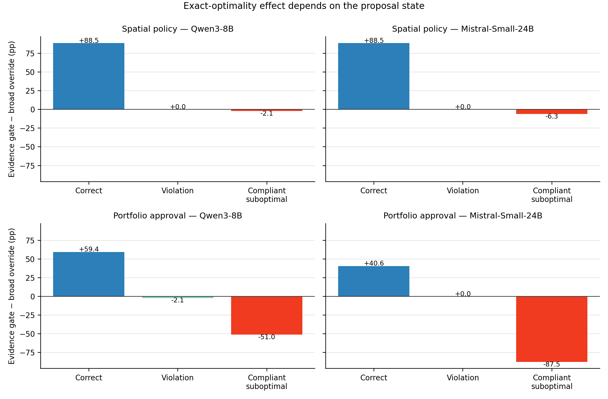

# Institutional Representation Research

*How institutions translate represented objectives into binding collective decisions.*

[](https://github.com/tofuadmiral/institutional-representation-abm/actions/workflows/ci.yml)
[](https://www.python.org/downloads/)
[](LICENSE)
[](https://arxiv.org/abs/2608.24554)
[](https://doi.org/10.5281/zenodo.22119500)

This repository contains two related but separate studies. Paper 1 uses a
rule-based agent-based model of democratic legislative institutions. Paper 2
uses open-weight language models in a proposer-reviewer decision pipeline. The
shared question is how institutional rules shape the translation from represented
preferences or duties to final outcomes.

## Papers

### Paper 1 — published preprint and frozen release

**Why fragmented parliaments stop passing legislation: Opposition discipline
and representation across four democratic institutions**

- [arXiv:2608.24554](https://arxiv.org/abs/2608.24554)
- [Manuscript PDF](paper/main.pdf)
- [Conference poster](paper/poster.pdf)
- [Interactive model](https://institutional-representation-abm.streamlit.app/)
- Canonical reproducibility snapshot: [`v1.0.2`](https://github.com/tofuadmiral/institutional-representation-abm/releases/tag/v1.0.2)
- Archived software DOI: [10.5281/zenodo.22119501](https://doi.org/10.5281/zenodo.22119501)

Paper 1 compares parliamentary, presidential/republican,
premier-presidential, and president-parliamentary systems. Across simulation,
sensitivity analysis, and mechanism ablations, it finds that fragmentation
alone does not stop legislation: collapse requires cohesive opposition
discipline. It also identifies a passage-representation tradeoff between
legislative throughput and the distance of enacted policy from constituency
preferences.

The root `CITATION.cff` and `.zenodo.json` describe the frozen Paper 1 software
release. Later commits on `main` include Paper 2 and are not the tree analyzed by
Paper 1.

### Paper 2 — complete working manuscript

**Who May Overrule the Agent? Evidence-Gated Authority in LLM Review
Institutions**

- [Manuscript PDF](paper2/main.pdf)
- [Paper 2 source and reproduction guide](paper2/README.md)
- [Frozen processed results and raw model outputs](paper2/data/README.md)

Paper 2 studies a two-agent decision institution. An upstream language-model
agent proposes a binding action, and a second language-model agent reviews it.
The treatment changes only the reviewer's jurisdiction:

- **Broad override:** any parseable recommendation can replace the proposal.
- **Evidence gate:** replacement requires a mechanically valid record of a
  binding-constraint violation and a compliant repair.

Across Qwen3-8B and Mistral-Small-24B, the gate protects correct and compliant
proposals while retaining most repairs of violations. It also prevents reviewers
from improving compliant but suboptimal proposals. The resulting finding is a
correction-corruption frontier: the exact-welfare winner depends on the upstream
mix of proposal states and the reviewer's state-conditional competence.

<p align="center">
  
</p>

## Quick start

Create the shared analysis environment and run the full test suite:

```bash
python3 -m venv .venv
source .venv/bin/activate
pip install -r requirements.txt
pytest tests/ -v
```

### Reproduce Paper 1

For exact Paper 1 reproduction, check out tag `v1.0.2`. On the current tree,
the original commands remain available:

```bash
# Four institutions × four scenarios, N=200 seeds
python -m experiments.multiseed_comparison --scenarios all --seeds 200 --output results/main/

# Hung-parliament decomposition
python -m experiments.hung_parliament --seeds 200 --output results/phase_h/

# Sensitivity analysis and mechanism ablations
python -m experiments.sensitivity --output results/main/
python -m experiments.ablation --scenarios baseline fragmented polarized --seeds 200 --output results/main/

# Interactive UI
streamlit run streamlit_app/app.py
```

Build the Paper 1 PDF with `make -C paper`.

### Reproduce Paper 2 without model calls

All reported model outputs are frozen in `paper2/data/`. Regenerate the figures,
tables, and PDF without downloading a model:

```bash
MPLBACKEND=Agg python paper2/scripts/build_artifacts.py
make -C paper2

# Build the minimal arXiv source upload after compiling the manuscript
make -C paper2 arxiv-package
```

The arXiv target creates `paper2/arxiv-submission.tar.gz`; it excludes model
outputs and code that are useful for repository reproducibility but unnecessary
for the arXiv compiler.

### Rerun the Paper 2 model experiments

The original runs used a local OpenAI-compatible MLX server and the model IDs
`mlx-community/Qwen3-8B-4bit` and
`mlx-community/Mistral-Small-24B-Instruct-2501-4bit`. After starting one model
at `http://127.0.0.1:8000/v1`, the frozen experiments can be rerun as follows.
Qwen must be served in answer-only mode with
`--chat-template-args '{"enable_thinking":false}'`, matching the retained Paper
2 outputs and preventing hidden reasoning from consuming the response budget.
For the 24B Mistral model, bound the server's decode concurrency, prompt
concurrency, and prompt-cache size to the client worker count to avoid retaining
inactive KV caches alongside four long requests:

```bash
# Controlled spatial-policy states
python -m experiments.prospective_certificate_gate \
  --model mlx-community/Qwen3-8B-4bit \
  --mandate-design multi_eligible --tasks-per-scenario 32 \
  --base-seed 95000 --agents 7 --output results/paper2/spatial_qwen

# Naturally generated upstream proposals
python -m experiments.natural_proposer_validation \
  --model mlx-community/Qwen3-8B-4bit \
  --tasks-per-scenario 32 --base-seed 95000 --agents 7 \
  --output results/paper2/natural_qwen

# Portfolio-transfer benchmark
python -m experiments.portfolio_certificate_gate \
  --model mlx-community/Qwen3-8B-4bit \
  --tasks-per-stratum 32 --base-seed 120000 \
  --output results/paper2/portfolio_qwen

# Explicit retain/replace/escalate reviewer validation
python -m experiments.action_aware_reviewer_validation \
  --model mlx-community/Qwen3-8B-4bit --workers 8 \
  --output results/paper2/action_aware_qwen
```

Repeat with the Mistral model ID for the cross-model replication. The command
line accepts a different `--base-url`, so a compatible hosted endpoint can be
used, but that would be a new replication rather than the frozen local run.

## Repository map

| Path | Purpose |
|---|---|
| `paper/` | Paper 1 manuscript, bibliography, poster, and PDF |
| `institutions/`, `agents/`, `bills/`, `config/` | Paper 1 Mesa model |
| `analysis/` | Paper 1 statistical and plotting code |
| `streamlit_app/` | Paper 1 interactive interface |
| `agent_exploration/` | Paper 2 preferences, mandates, authority rules, metrics, and local-model interface |
| `experiments/` | Runners and analyses for both papers |
| `paper2/` | Paper 2 manuscript, frozen data, figures, tables, and artifact builder |
| `tests/` | Regression and unit tests for both research programs |
| `docs/` | Paper 1 ODD protocol, metadata, figures, and implementation notes |

## Reproducibility boundaries

Paper 1's exact published tree is release tag `v1.0.2`; its deterministic
seed-42 fixture is enforced by CI. Paper 2 uses deterministic task generators,
fixed task streams, temperature-zero decoding, task-clustered bootstrap
intervals, and a checked-in archive of every prompt and raw response. Exact
language-model generations can still depend on model revisions and inference
software, so the frozen outputs—not a newly downloaded checkpoint—are the source
for the manuscript's reported numbers.

## Citation

For Paper 1:

```text
Ali, F. (2026). Why fragmented parliaments stop passing legislation:
  Opposition discipline and representation across four democratic institutions.
  arXiv:2608.24554. https://arxiv.org/abs/2608.24554
```

Paper 2 is a working manuscript and does not yet have an archival identifier.
Its title, author, and frozen evidence are recorded in `paper2/`.

## License

[MIT](LICENSE). Copyright 2025–2026 Fuad Ali.
